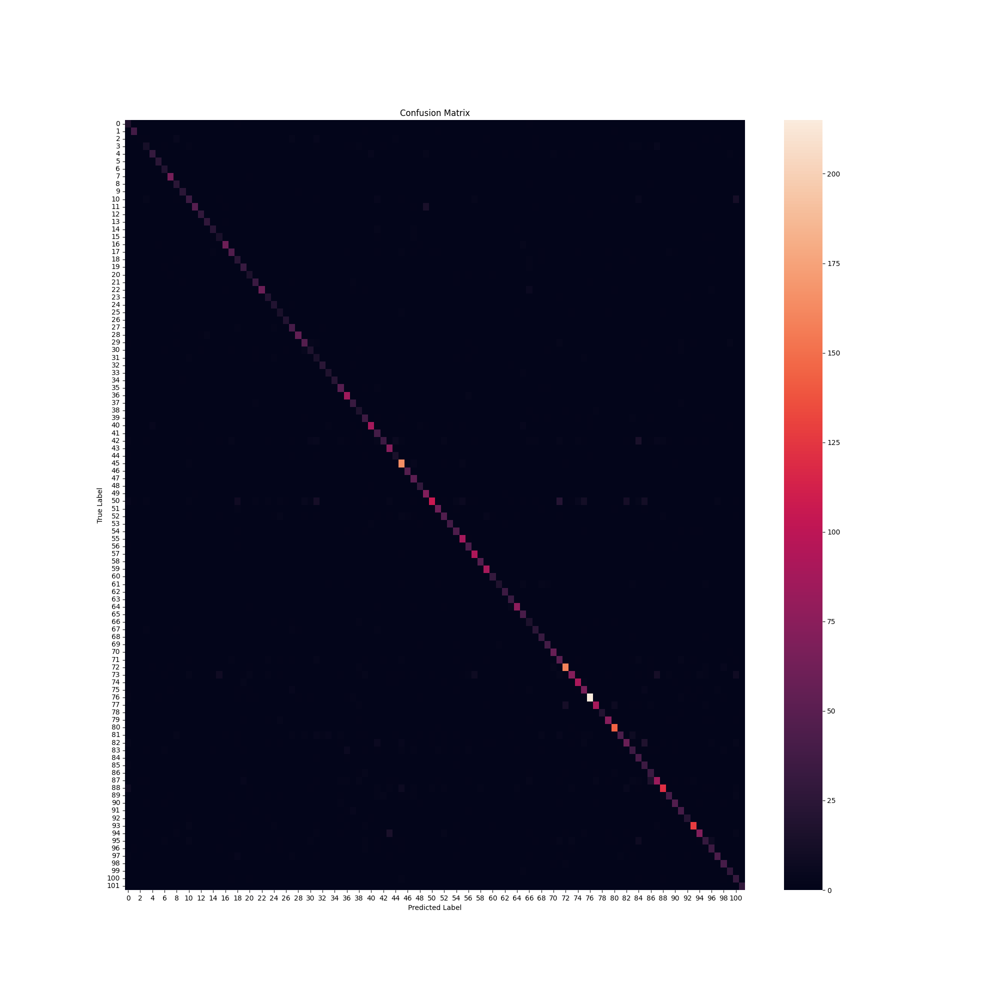

# 🌸 Fulla 🌸

**Fulla (فلة)** is a deep learning project that classifies flowers from images using a ResNet-based neural network and transfer learning. Built with **PyTorch** and deployed with **Gradio**, this app blends the elegance of nature with the power of machine learning.

> Upload a picture of a flower. Watch the model guess. Let it bloom!

## 🖼️ Live Demo

> [👉 Try it on Hugging Face Spaces](https://huggingface.co/spaces/salihelfatih/fulla)

## 🔍 Overview

- 🌼 **102 Flower Classes**: Trained on the comprehensive [Flowers102 dataset](https://pytorch.org/vision/stable/generated/torchvision.datasets.Flowers102.html).
- 🧠 **Transfer Learning**: Built on a pre-trained ResNet model for powerful feature extraction.
- 🧪 **High Accuracy**: Achieves strong performance on the test set.
- 🖼️ **Interactive UI**: A simple, beautiful interface built with Gradio.
- 🚀 **Deployed**: Live and accessible on Hugging Face Spaces.

## 📊 Results

The model was evaluated on a held-out test set, achieving the following performance:

- **Final Test Accuracy**: 79.38%
- **Weighted F1-Score**: 0.7886

### Confusion Matrix

The confusion matrix below shows the model's high performance, with a strong diagonal indicating correct predictions across most classes.



## 🛠️ How to Run Locally

1. **Clone the repository:**

    ```bash
    git clone [https://github.com/salihelfatih/fulla]
    cd Fulla
    ```

2. **Install dependencies:**

    ```bash
    pip install -r requirements.txt
    ```

3. **Launch the app:**

    ```bash
    python -m app.interface
    ```

## 🧠 Model Architecture

- **Backbone**: Pre-trained ResNet (ImageNet)
- **Strategy**: Freeze the feature extractor and train a new classifier head with 102 outputs.
- **Loss**: `CrossEntropyLoss`
- **Optimizer**: `Adam`
- **Framework**: PyTorch

## 📁 Project Structure

```plaintext
fulla/
├── fulla_core/
│   ├── model.py
│   ├── train.py
│   └── utils.py
│
├── app/
│   └── interface.py
│
├── main.ipynb   
├── fulla_model.pth
├── README.md 
└── requirements.txt
```

## 🧾 License

MIT License — free to use, remix, and bloom!

## 🙌 Credits

Developed by Salih Elfatih as a capstone project on deep learning and computer vision. Flowers bloom. So should code!
